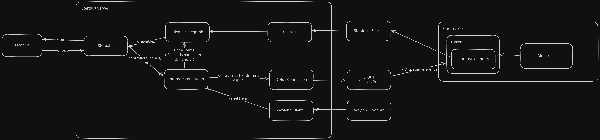

# Overview

Stardust XR _(formerly known as Stardust)_ is an XR [display server](https://itsfoss.com/display-server) designed for Linux-based systems<!-- (possibly most unix-based too, but untested)-->. 
Unlike traditional display servers that focus on 2D screens, Stardust XR introduces new conventions to utilize unbounded 3D space in virtual or real environments.

## Priorities

- **3D Environment Focus**: While supporting 2D clients through the Wayland protocol, Stardust XR primarily aims to create and manage 3D environments.

- **Standard Interfaces**: Utilizes Wayland and OpenXR for 2D and XR app integration.

- **Stardust Protocol**: Implements a special protocol for:
  - Creating virtual objects
  - Developing 3D UIs around 2D apps (Panel Shells)
  - Handling data as Items that can represent files, Wayland surfaces, etc.

- **Personal Device Interaction**: Focuses on individual user interactions rather than collaborative 3D spaces.

- **Flexible Object Interaction**: Users can choose objects that best suit their current scenario, with easy setup for default configurations.

## Architecture

## Projects & Components

- [**telescope**](https://github.com/StardustXR/telescope): bundle most used components to have a demo environment set up
- ...

<!-- TODO: add more core components and projects! -->

