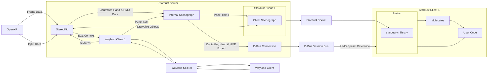

# Brief Overview

Stardust XR is an XR [display server](https://itsfoss.com/display-server) designed for Linux-based systems<!-- (possibly most unix-based too, but untested)-->. 
Unlike traditional display servers that focus on 2D screens, Stardust XR introduces new conventions to utilize unbounded 3D space in virtual or real environments.

## Priorities

- **3D Environment Focus**: While supporting 2D clients through the Wayland protocol, Stardust XR primarily aims to create and manage 3D environments.

- **Standard Interfaces**: Utilizes Wayland and OpenXR for 2D and XR app integration.

- **Stardust Protocol**: Implements a special protocol for:
  - Creating virtual objects
  - Developing 3D UIs around 2D apps (Panel Shells)
  - Handling data as Items that can represent files, Wayland surfaces, etc.

- **Personal Device Interaction**: Focuses on individual user interactions rather than collaborative 3D spaces.

- **Flexible Object Interaction**: Users can choose objects that best suit their current scenario, with easy setup for default configurations.

## Architecture

## Projects & Components

- [**armillary**](https://github.com/StardustXR/Armillary): A 3D model viewer for Stardust XR; rotate, move, and display models in your XR space 
- [**atmosphere**](https://github.com/StardustXR/atmosphere): 3D environment with natural momentum-based movement
- [**black hole**](https://github.com/StardustXR/black-hole): Universal minimization of Stardust objects
- [**comet**](https://github.com/StardustXR/comet): Annotate in 3D wherever you want amongst your other apps!
- [**core lib**](https://github.com/StardustXR/core): Rust crates and schemas for connecting stardust server and client
- [**flatland**](https://github.com/StardustXR/flatland): Allows Starust XR to run 2D linux applications 
- [**gravity**](https://github.com/StardustXR/gravity): Launch programs with a certain offset in 3D space
- [**magnetar**](https://github.com/StardustXR/magnetar): Example workspaces client
- [**non-spatial-input**](https://github.com/StardustXR/non-spatial-input): Provides utilities to port keyboard, mouse, and other input methods like libinput into Stardust XR
- [**protostar**](https://github.com/StardustXR/protostar): App launcher library and examples including futuristic hexagon launcher
- [**server**](https://github.com/StardustXR/server): Reference implementation of the StardustXR server (similar to Xorg)
- [**telescope**](https://github.com/StardustXR/telescope): Stable stardust setup for quick and easy usage
- [**website**](https://github.com/StardustXR/website): The location where documentation is done and the website is generated from
